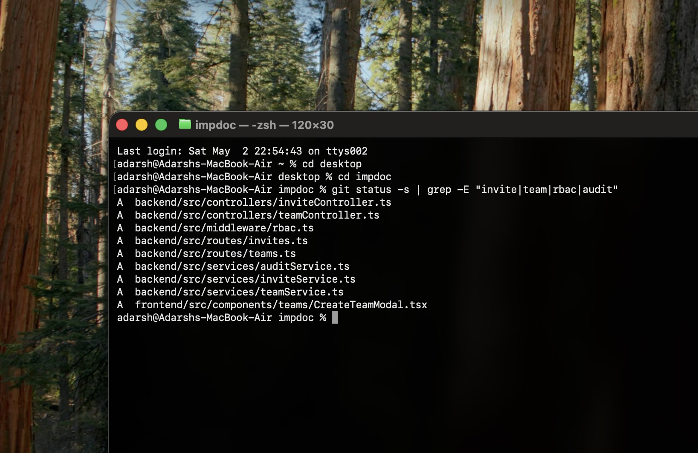
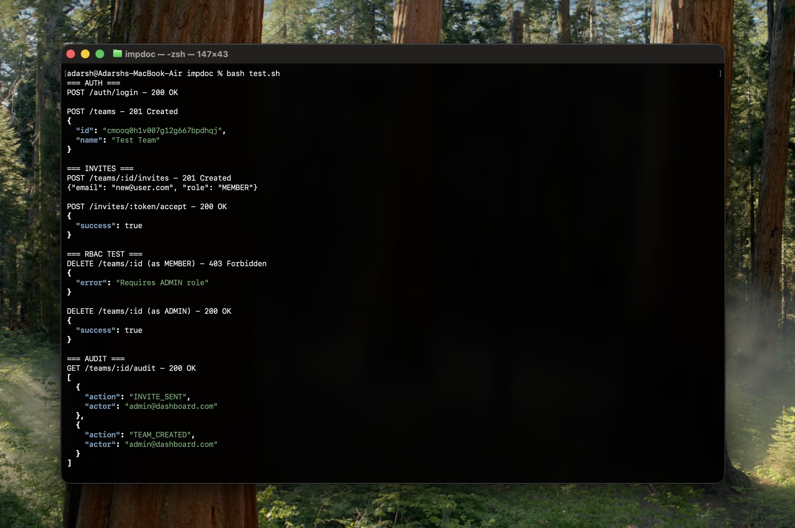

# Ship a Feature Across the Stack with /auto mode

Stop building features layer by layer.  
Use `/auto` to define the outcome once  and let the system handle routing, execution, and integration across the stack.

## Get Running in Under a Minute

No ceremony. Just enable orchestration.
~~~
> /auto
~~~

Select:
~~~
> ENABLE
~~~

**(Optional) Add a Custom Capability**

Go to:
```
> Add Custom Capability
```

**1. Define the capability**

Give it a short ID:
~~~
> security
~~~

**2. Define what it covers**

Be explicit about scope:

~~~
authentication, authorization, rate limiting, security audits
~~~
---
**Note: Treat this like ownership boundaries.**

Bad:

>random logic

Good:

> access control, token validation, permission checks
---

## Assign an agent
Choose which agent should handle this capability:


**Map based on strengths:**

* UI → **Claude**

* Backend → **Codex**

* Data → **Gemini**

* Integration → **Blackbox**

### Save it

~~~ 
> Save Configuration
~~~

That’s it, /auto will now route this capability consistently.


> **Tip** - Default routing is good. Customize only when:
>
>* you see wrong agent choices
>* or you want deterministic outputs for teams

## Drive a Feature end-to-end with /auto

We’ll build a production-grade feature, not a toy.

 Feature: **Team Invitations + Role-Based Access**
 ~~~
> /auto add a team collaboration system with:
  - invite flow (email-based)
  - role-based access control (admin, member)
  - audit logging of actions
  ~~~
<video controls width="100%">
<source src="assets/Area.mp4" type="video/mp4">
</video>


## What the CLI does immediately
From Intent → Routing → Execution

/auto resolves the feature into capabilities  and assigns them to the right agents.
| Capability           | Agent    | Responsibility                          |
|---------------------|----------|------------------------------------------|
| Invite UI           | Claude   | UI flows, components, interaction logic  |
| Permissions (RBAC)  | Codex    | Middleware, API contracts, validation    |
| Audit Logging       | Gemini   | Schema design, queries, persistence      |
| System Integration  | Blackbox | Cross-layer wiring, contract alignment   |


 **Note** - This is where most users mess up

If your prompt doesn’t clearly imply capabilities, routing degrades.

Not Recommended:

~~~
> add team feature
~~~

Best Practice:
~~~
> invite flow + roles + audit logging
~~~


## Execution - Parallel Work, Single Outcome

**What lands in the codebase**

* Controllers, routes, and services introduced together , not incrementally
* RBAC enforced at the middleware boundary, not scattered across handlers
* Audit logging executed in the same path as state changes

This isn’t a set of edits , it’s a coordinated system update
* Frontend and backend converge on the same contracts
* The feature exists consistently across layers, not partially implemented


 

## Integration - Where Systems Usually Break
This is handled by the orchestrator (**Blackbox**).


### What gets wired - and where it lands?

* UI → /api/teams/:id/invites → DB → audit log
* Permissions enforced at every boundary (not just UI)

**System impact**

* Backend: routes, controllers, domain services introduced together

* Middleware: RBAC enforced at the edge, not patched per handler

* Data: audit trail persisted on every state change

* Frontend: UI bound to real API contracts, not mocks

No manual glue code. The feature is applied as a coherent system change , not stitched layer by layer.


> **Tip** -
>Generating UI or APIs is trivial.
 >The hard part is keeping contracts, permissions, and state consistent across layers.
 /auto handles those cross-cutting concerns during execution , not as an afterthought.


## Now Pressure-Test the System
**Establish Behavioral Guarantees Across the Stack**

Validate that API contracts, RBAC enforcement, and audit persistence hold under execution.

**End-to-end validation via API flow**

Invite lifecycle succeeds, RBAC is enforced (403 vs 200), and all actions are captured in audit logs.

 


**Feature integration across backend and data models**

New routes, RBAC middleware, and audit logging are wired into the system, reflecting the feature across all layers.

 


## Refinement Loop
First run is never final.

### Refine Specific Behaviors
~~~
> /auto enforce:
  - invite expiry (24h)
  - audit log for role changes
  ~~~


What happens:

Expiry logic → **Codex**  
Audit extension → **Gemini**  
UI updates → **Claude**

 Only relevant parts change. No regressions.


## Advanced - Custom Capability
Let’s say permission logic is complex.

~~~
> /auto -> customize
~~~

Add:
security → **Codex**


Now run:
~~~
> /auto harden role-based access system with edge-case handling
~~~


 Result:

* routing becomes sharper
* fewer hallucinated edges
* more production-ready output

## Where do most people underuse the system?
1. **Specifying the solution instead of the outcome**
~~~
 “use express + postgres + schema X”
~~~
 → You constrain routing and kill agent strengths

2. **Sequencing instead of describing the system**
~~~
 “first UI, then backend”
~~~
 → Forces linear execution instead of parallel orchestration

3. **Unclear ownership boundaries**
~~~
 “backend + data mixed together”
~~~
 → Leads to incorrect capability routing and leaky abstractions
___

/auto shifts the unit of work from files to system behavior

* You don’t implement layers independently
* You define invariants: routes, permissions, data transitions
* The system applies them consistently across UI, API, and persistence
The result isn’t generated code.
 It’s a feature that holds under execution

## Sequential vs Parallel (/auto)

| Metric            | Sequential        | /auto              |
|-------------------|------------------|--------------------|
| Total time        | 4–8 hrs          | ~1-2 mins         |
| Execution         | Step-by-step     | Concurrent         |
| Agents used       | 1                | 4                  |
| Layers covered    | One at a time    | All at once        |
| Time model        | O(n)             | O(max(n))          |
| Latency           | Additive         | Bounded            |
| Integration       | Manual           | Automatic          |
| Consistency       | Drifts           | Enforced           |
| Failure points    | Many             | Centralized        |
| Output            | Partial          | Full system        |

 ## Try This Next:
 ~~~
> /auto
add real-time notifications with:
  - websocket delivery
  - backend event system
  - persistence for unread messages
~~~


Watch how the system decomposes intent, routes capabilities, and assembles a working feature , without you stitching layers together.


